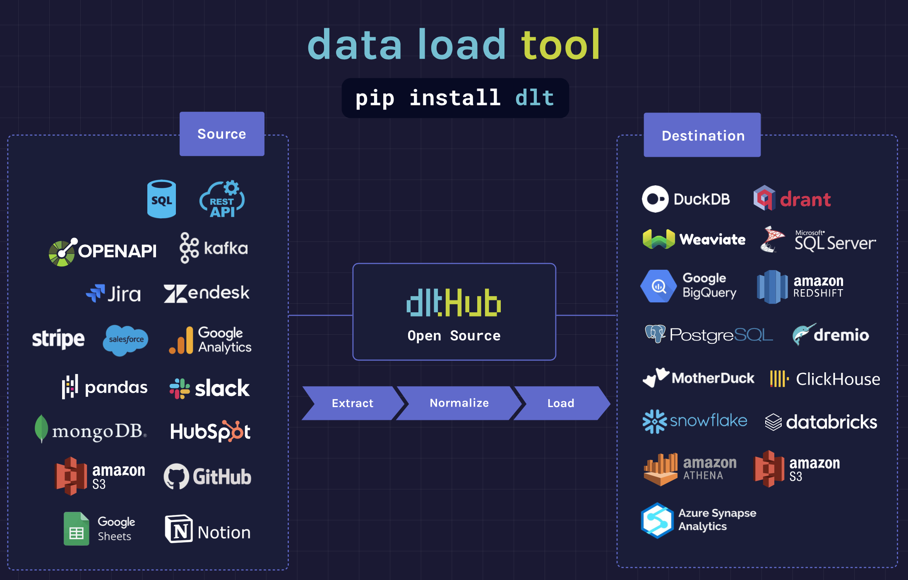
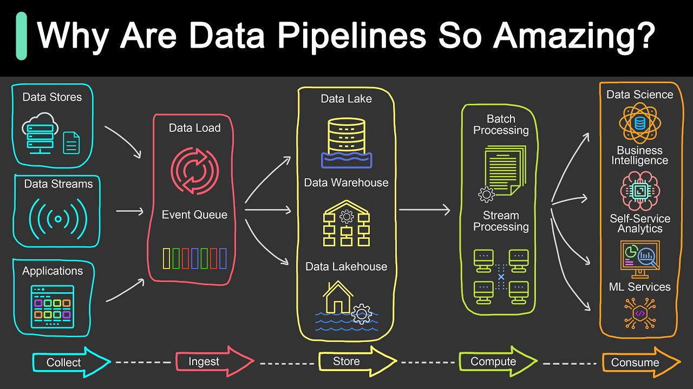
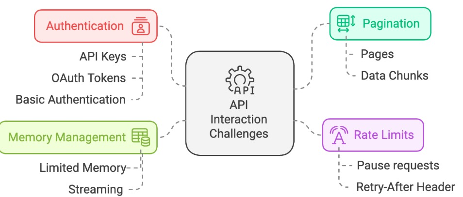

# Data_Ingestion_with_dlt
I build a data ingestion pipeline from APIs to warehouses and data lakes with dlt.

### The tools I use: 
- [dlt (data load tool)](https://dlthub.com): because it supports built-in REST API, automatic pagination handling, managing Rate Limits & Retries, streaming and seamless integration. [dlt Docs](https://dlthub.com/docs/dlt-ecosystem/verified-sources/)


### The steps I take:
0. Install packages/dependencies: `pip install 'dlt[duckdb]'` and `pip install 'dlt[bigquery]'`.

1. Extract data from API using `dlt resource` and `dlt RESTClient`.

2. Normalize raw, nested data with dlt pipeline, as it supports **schema detectioin, flattern nested JSON, data type conversion, split lists into child table**.

3. Load data to local db with dlt to **handle schema validation, incremental loading, batch processing, streaming, error handling, and retries**.
```py
import dlt
from dlt.sources.helpers.rest_client import RESTClient
from dlt.sources.helpers.rest_client.paginators import PageNumberPaginator
# Define the API resource for NYC taxi data
@dlt.resource(name="rides")   # <--- The name of the resource (will be used as the table name)
def ny_taxi():
    client = RESTClient(
        base_url="https://us-central1-dlthub-analytics.cloudfunctions.net",
        paginator=PageNumberPaginator(
            base_page=1,
            total_path=None
        )
    )
    for page in client.paginate("data_engineering_zoomcamp_api"):    # <--- API endpoint for retrieving taxi ride data
        yield page   # <--- yield data to manage memory

# define new dlt pipeline
pipeline = dlt.pipeline(destination="duckdb")

# run the pipeline with the new resource
load_info = pipeline.run(ny_taxi, write_disposition="replace")
print(load_info)

# explore loaded data
pipeline.dataset(dataset_type="default").rides.df()
```
4. Incremental load data using `dlt.sources.incremental`.
    - Append: for immutable & stateless data.
    - Merge: update existing stateful data.

5. Load data to data warehouses (BigQuery, Snowflake, Redshift) or data lakes (S3, Google Cloud Storage, Parquet files) or switch between them with dlt.

The core skills required to build and manage data pipelines:
- Build robust, scalable, and self-maintaining pipelines.
- Best practices, like built-in data governance, for ensuring clean and reliable data flows.
- Incremental loading techniques to refresh data quickly and cost-effectively.
- Build a Data Lake with dlt.

### Data ingestion
**Data ingestion** is the process of **extracting** data from a source, transporting it to a suitable environment, and preparing it for use. It includes **normalizing**, **cleaning**, and **adding metadata**, and **loading**.

### Data pipelines:
Including 5 steps: 

1. **Collect**:  
   Data pipelines gather information from a variety of sources, such as databases, data streams, and applications. 
2. **Ingest**:  
   The collected data flows into an event queue for the next steps.  
   - **Structured data** (like Parquet files or database tables) can be processed immediately.  
   - **Unstructured data** (like CSV or JSON files) often needs cleaning and normalization.   
3. **Store**:  
   Pipelines send the processed data to **data lakes**, **data warehouses**, or **data lakehouses** for efficient storage and easy access.   
4. **Compute**:  
   Data is processed either in **batches** (large chunks) or as **streams** (real-time updates) to make it ready for analysis.  
5. **Consume**:  
   Finally, the prepared data is delivered in various forms:
   - **Dashboards** for executives and analysts.  
   - **Self-service analytics tools** for teams exploring trends.  
   - **Machine learning models** for predictions and automation.  

### **Extracting data from API**

Common Types of APIs:
- **RESTful APIs**: Provide records of data from business applications.  
  - Example: Getting a list of customers from a CRM system.  
- **File-based APIs**: Return secure file paths to bulk data like JSON or Parquet files stored in buckets.  
  - Example: Downloading monthly sales reports.  
- **Database APIs**: Connect to databases like MongoDB or SQL, often returning data as JSON, the most common interchange format.  


Factors to consider on extracing data from APIs:  
1. **Hardware limits**: Memory (RAM) and storage (disk space). 
To prevent your pipeline from crashing, you need to control memory usage.  
- Many pipelines run on systems with limited memory, like serverless functions or shared clusters.  
- If you try to load all the data into memory at once, it can crash the entire system.  
- Even disk space can become an issue if you’re storing large amounts of data. 

Solution: **Streaming**: process data in small chunks or events, rather than loading everything at once. This keeps memory usage low and ensures your pipeline remains efficient.
Use streaming to transfer data between buffers, such as:  
- from APIs to local files;  
- from Webhooks to event queues;  
- from Event queues (like Kafka) to storage buckets.

2. **Network reliability**: Networks can fail! Always account for retries to make your pipelines more robust. dlt has built-in retry mechanisms.  

3. **API rate limits**: 
To avoid hitting these limits, we can:  
- **Monitor API rate limits** – Some APIs provide headers that tell you how many requests you have left.  
- **Pause requests when needed** – If we're close to the limit, we wait before making more requests.  
- **Implement automatic retries** – If a request fails due to rate limiting, we can wait and retry after some time.  
Some APIs provide a **retry-after** header, which tells you how long to wait before making another request. Check the API documentation.

4. **Pagination**

5. **Authentication**: Many APIs require an **API key or token** to access data securely. Without authentication, requests may be limited or denied.  
**Types of Authentication in APIs:**  
- **API Keys** – A simple token included in the request header or URL.  
- **OAuth Tokens** – A more secure authentication method requiring user authorization.  
- **Basic Authentication** – Using a username and password (less common today). 
